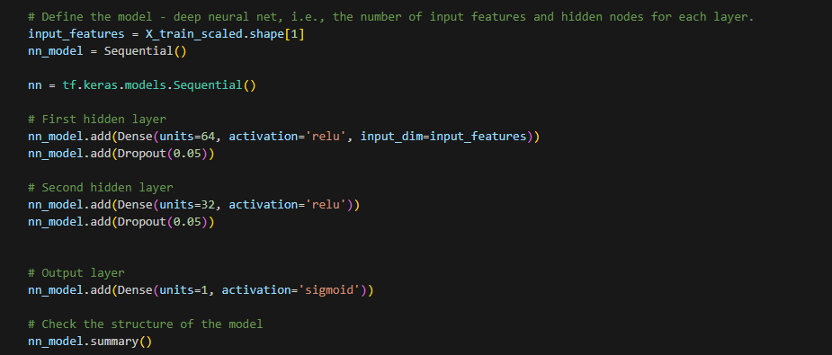
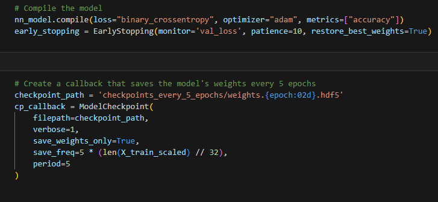
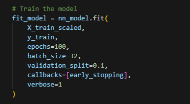
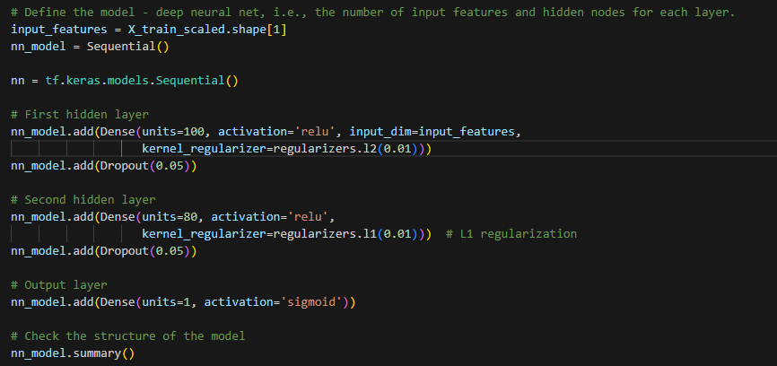
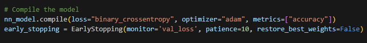
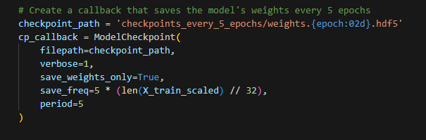
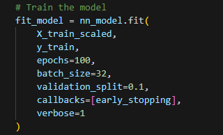
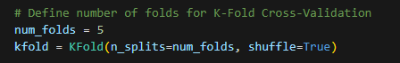
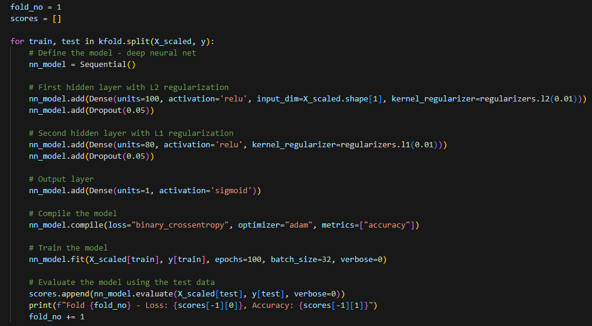
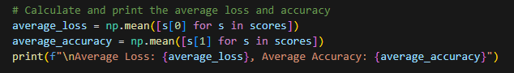

# deep-learning-challenge
## Report on Alphabet Soup Charity Funding Success Prediction

### Executive Summary
As a Data Analyst at Alphabet Soup Charity, my objective was to create a binary classifier to predict the success of funding applications. By utilizing machine learning and neural networks on a dataset with over 34,000 past applications, I developed a model aimed at distinguishing applicants most likely to succeed upon receiving funding. This report documents the methodologies, processes, and findings of the analytical exercise.

### Data Preprocessing
The foundational stage of data analysis involved loading the dataset for initial exploration. The preprocessing steps encompassed:

- **Target Variable Identification**: The 'IS_SUCCESSFUL' column was identified as the target variable, indicating the effectiveness of the funding usage.
- **Feature Selection**: Identifiers such as 'EIN' and 'NAME' were dropped to focus on predictive attributes.
- **Unique Value Analysis**: Evaluated the dataset for unique values, aiding in understanding the data's complexity.
- **Categorical Variable Binning**: 'APPLICATION_TYPE' and 'CLASSIFICATION' columns underwent binning to condense sparse categories and reduce overfitting risks.
- **One-Hot Encoding**: Categorical variables were transformed into numerical format via `pd.get_dummies()`.
- **Data Splitting**: Segregated data into feature (X) and target (y) sets, followed by a train-test split.
- **Feature Scaling**: Normalized feature scales using `StandardScaler` to ensure optimal neural network model input.

### Model Development (Starter_code)
The neural network model was architected with:

Input Layer: Defined by the post-encoding feature count.
Hidden Layers: Incorporated two hidden layers with a 'relu' activation.
Dropout Regularization: Integrated at a rate of 0.5 for each hidden layer to mitigate overfitting.
Output Layer: Single neuron with 'sigmoid' activation tailored for binary outcome prediction.
Compilation: Employed adam optimizer for convergence efficacy and binary cross-entropy loss suitable for binary classification.
Callbacks: EarlyStopping was utilized to cease training when no validation loss improvement was detected, avoiding overfitting.

### Model Optimization (Optimized_Starter_Code)
In the optimized version of the model, the following changes were made:

Increased Neuron Count: Increased the number of neurons in hidden layers for greater model complexity.
Regularization: Introduced L1 and L2 regularization in the hidden layers to prevent overfitting and promote model generalization.
Hyperparameter Adjustments: Tuned dropout rates and regularization parameters for better model performance.
Resulting Accuracy: The optimized model achieved an approximate accuracy of 79%.

### Model Optimization (Optimized_KFOLD_Starter_Code)
A further step to enhance the model included implementing K-fold cross-validation:

K-Fold Cross-Validation: Applied 5-fold cross-validation to evaluate the model's performance more robustly across different data subsets.
Model Re-Initialization: For each fold, the model was re-initialized to ensure independent and fair evaluation.
Resulting Accuracy: The K-fold cross-validation model achieved an approximate accuracy of 71%.

### Comparative Analysis of Model Architectures
In this project, I developed three distinct neural network models to predict the success of funding applications for Alphabet Soup Charity. Each model iteration introduced various optimizations and techniques to enhance performance while maintaining the same preprocessing steps. 
Below, I visually compare the main differences between all three models:

#### The first model (Starter_code)
The first model served as our baseline architecture. It primarily focused on a straightforward neural network design without additional regularization or complexity.

#### The second model (Optimized_code)
In the optimized model, I introduced several key improvements including increased neuron counts in hidden layers and the implementation of L1 and L2 regularization. These changes aimed to enhance the model's capacity to learn more complex patterns and reduce overfitting.

#### The third model (Optimized Model with K-Fold Cross-Validation)
The final iteration of my model employed K-fold cross-validation to ensure robust evaluation. This method provided a more reliable assessment of the model's performance across various subsets of the data.

### Training and Evaluation
Model training was executed over multiple epochs with batch size 32, while training and validation accuracies were monitored for learning progression.

### Results
Original Model: The initial model achieved an accuracy close to 73% on the test set.
Optimized Model: The optimized model, with increased complexity and regularization, achieved an approximate accuracy of 79%.
Optimized Model with K-Fold Cross-Validation: The model utilizing K-fold cross-validation demonstrated an average accuracy of approximately 71%, indicating robustness and consistency across different data subsets.

### Key Steps for Improvement
- **Hyperparameter Tuning**: Plans include methodical tuning of hyperparameters like neurons, layers, and learning rates.
- **Advanced Feature Engineering**: Further sophisticated feature engineering is expected to improve model performance.
- **Ensemble Methods**: Application of model ensembles to refine predictions.

### Conclusion and Recommendations
The constructed neural network model lays the groundwork for predictive analytics in funding application success. Despite not achieving the 75% accuracy benchmark, the model's potential is evident. I recommend a progressive model refinement strategy and consideration of alternative machine learning techniques for enhanced accuracy.

### Future Directions
To continue advancing this project, the following is proposed:

Further Cross-Validation Implementation: Additional cross-validation strategies to assess model stability.
Alternative Models Exploration: Benchmarking against other machine learning models for comparative insights.
Ongoing Data Training: Continuously updating the model with new data to maintain its relevance to current application trends.

###### Data provided by IRS. Tax Exempt Organization Search Bulk Data Downloads. https://www.irs.gov/Links to an external site.
###### Data for this dataset was generated by/for edX Boot Camps LLC, and is intended for educational purposes only
